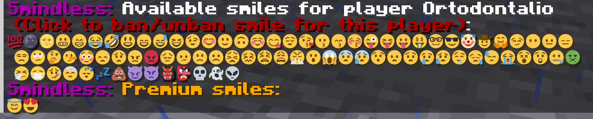

# Hello, chat!
A small plugin, that allows players to use smiles in the Minecraft server chat. 
It works together with a server (client) resource pack, which contains a [file](resourcepack/assets/minecraft/textures/font/unicode_page_90.png) 
with custom smiles.

_The main features of this small plugin are:_
* Small size;
* **Advanced customization**: the ability to change plugin messages in [config.yml](plugin/src/main/resources/config.yml), 
add or remove smiles for every taste, depending on [the server datapack](resourcepack);
* The ability **to use multiple placeholders** for a single smile (it will be useful when used together with plugins that integrate Discord with the minecraft server);
* The plugin uses **its own access control system** for smiles: now it isn't needed to pile up the server permissions with perms for each smile!
* The ability to copy the placeholder of a smile by simply pressing the LMB in the chat;
* The ability to assign premium smiles.

# So, what's the first step?
The [main configuration file](plugin/src/main/resources/config.yml) of the plugin can be divided into two parts:
* message texts;
* smiles definition.

In the **message texts section**, you can write absolutely any text for each situation (lack of rights, wrong player, etc.). 
So instead of the prefix **Smindless**, you can, for example, use the name of the server. Keep in mind that messages support color schemes.

As for the **smiles definition section**, it consists of a set of smiles with the following format:
```
[Smile Key]:
  inputs: ":placeholder_1:,:placeholder_2:,...,:placeholder_N:"
  output: Decoded unicode symbol
  premium: true/false
```
**Smile key** is the key that will need to be specified in the commands for managing access rights to the smile.
It should be any set of characters **without a space**.

**Inputs** is what the player must type in the chat in order for the text to turn into a smile. Must have a format `:sometext:`.
Multiple placeholders are separated by a comma. Keep in mind that it is preferable to have a short placeholder if you do 
not want the player to manually enter text for a long time to convert into a smile. 

**Output** is what any of the typed placeholders will turn into.

**Premium** indicates whether this smile is a premium. It can be `true`, `false`, or omitted. If omitted, it is considered as `false`.

For example, for the next smile
```
cute:
  inputs: ":cute:"
  output: "逃"
```
> Wow, it's sooo cute!:cute: 

will turn into

>Wow, it's sooo cute!逃

This hieroglyph turns into a beautiful smile face with a server datapack. [The first file](resourcepack/assets/minecraft/font/default.json) 
from the datapack contains a sequence of unicode characters on the 90th page, and [the second file](resourcepack/assets/minecraft/textures/font/unicode_page_90.png) 
displays these characters in the chat, respectively. The size of the second file is 768 by 786 pixels. This file contains 16 by 16 images (smiles). 
It's easy to guess that the size of one smile with this file size will be 48 by 48 pixels. The file size can be reduced or increased, 
but do not use sizes where the size of the smile will have fractional values!

# Main commands
The only command provided by the plugin is <code>/smi</code>. Next, flags are used for certain operations. 
The most important operation that must be performed at the beginning of the server work, or every time the list of smiles 
in [config.yml](plugin/src/main/resources/config.yml) is changed, is <code>/smi reload</code> or <code>/smi r</code>.
> <code><b>/smi r</b></code> - loads a list of smiles into memory so that they become available to players 
> (or overloads the list if there have been changes; you don't need to overload the server every time, 
> it is enough to execute this command if there have been changes)

After that, you can check the list of smiles through the command <code>/smi list</code> or <code>/smi l</code>.
> <code><b>/smi l</b></code> - get a list of smiles. In this menu, you can use the LMB to copy some smile, then paste it into the chat.
> 
> If you hover the mouse over some smile, you can see its placeholders - this is the text that needs to be printed in order 
> for the smile to appear in the chat when sending a message.
> 

You may have noticed _gray smiles_ in the screenshots - these are the smiles that the player won't be able to send, 
even if the player copies or enters a placeholder. This is because this smile has been banned for the player or 
the player doesn't have premium access for this smile. To block or allow the use of a smile, there are commands
<code>/smi b {playerName} {smilePlaceholder}</code> and <code>/smi ub {playerName} {smilePlaceholder}</code>, respectively.
> <code><b>/smi b {playerName} {smilePlaceholder}</b></code> - the command to block the possibility of using the smile from the specified player.
> Please use placeholders, not the smiles themselves, for all access control commands.
> 
> After blocking, the smile will turn gray, which means that there is no access to this smile.
> 
> <code><b>/smi ub {playerName} {smilePlaceholder}</b></code> - it works the same way, only on the contrary, it unlocks the smile.

The next pair of commands is to grant or revoke premium smiles.
> <code><b>/smi g {playerName} {smilePlaceholder}</b></code> - grants the right of access to the premium smile to the specified player.
> 
> <code><b>/smi ug {playerName} {smilePlaceholder}</b></code> - works the same way, only it takes away access rights to the premium smile.

In order not to mess with access control commands, it is also possible to view lists of available smiles from other players, 
as well as to give and take away rights using LMB.
> <code><b>/smi pl {playerName}</b></code> - show a list of smiles for the specified player. 
> Use the LMB to give or take away the rights to a certain smile from the player.
> 

That's all for now! Keep in mind that access to smiles is stored in the plugin folder in two sub-folders - _ban-list_ and _premium-list_. 
So you can also add or remove smiles' keys <b>(these are the keys from the config.yml file, not placeholders!)</b> from players through files in these sub-folders.

# License
This project uses the [GNU AGPLv3 license (GNU Affero, GNU Affero General Public License Version 3)](COPYING).

# Do you have a question or proposal?
If you have any suggestions, ideas, and also bugs found, please contact the [telegram bot](https://t.me/am_support_bot), 
I will try to answer you as soon as possible, and I will be glad to receive your messages. 
Please do not write spam or insults, otherwise you will be blocked.